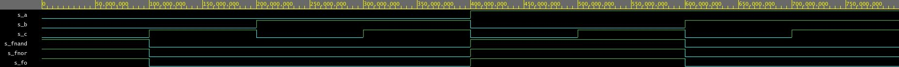
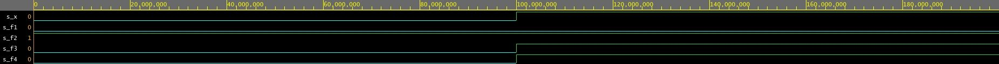
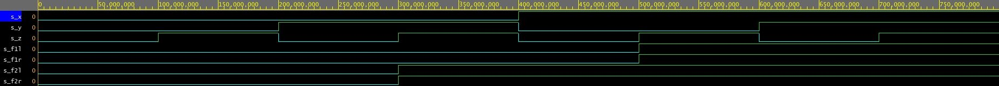

# Assignment 1
## Part 1
1. this **repository**
2. this *README.md*:
3. styles in `Markdown`:

| **a** | **b** |**c** |
| :-: | :-: | :-: |
| 0 | 1 | 0 |
```VHDL
architecture testbench of tb_gates is

    -- Local signals
    signal s_a    : std_logic;
    signal s_b    : std_logic;
    signal s_for  : std_logic;
    signal s_fand : std_logic;
    signal s_fxor : std_logic;

begin
```
* unordered list
* test 123

[Back to top of repository](https://github.com/ondrasouk/Digital-electronics-1)
## Part 2
## Part 3
### De Morgan's law verification


#### Truth table
| **c** | **b** |**a** | **f(c,b,a)** |
| :-: | :-: | :-: | :-: |
| 0 | 0 | 0 | 1 |
| 0 | 0 | 1 | 1 |
| 0 | 1 | 0 | 0 |
| 0 | 1 | 1 | 0 |
| 1 | 0 | 0 | 0 |
| 1 | 0 | 1 | 1 |
| 1 | 1 | 0 | 0 |
| 1 | 1 | 1 | 0 |

#### Code of architecture

```VHDL
architecture dataflow of gates is
begin
    fo_o  <= ((not b_i) and a_i) or ((not c_i) and (not b_i));
    fnor_o <= ((b_i nor (a_i nor a_i)) nor (c_i nor b_i)) nor ((b_i nor (a_i nor a_i)) nor (c_i nor b_i));
    fnand_o <= (((b_i nand b_i) nand a_i) nand ((c_i nand c_i) nand (b_i nand b_i)));

end architecture dataflow;
```

#### Playground link


#### Waveforms screenshot


### basic Boolean postulates
#### Code of architecture

```VHDL
architecture dataflow of gates is
begin
    f1_o <= x_i and not(x_i);
    f2_o <= x_i or not(x_i);
    f3_o <= x_i or x_i or x_i;
    f4_o <= x_i and x_i and x_i;

end architecture dataflow;
```

#### Playground link

#### Waveforms screenshot


### Distributive laws
#### Code of architecture

```VHDL
architecture dataflow of gates is
begin
    f1R_o <= (x_i and y_i) or (x_i and z_i);
    f1L_o <= x_i and (y_i or z_i);
    f2R_o <= (x_i or y_i) and (x_i or z_i);
    f2L_o <= x_i or (y_i and z_i);

end architecture dataflow;
```

#### Playground link

#### Waveforms screenshot

