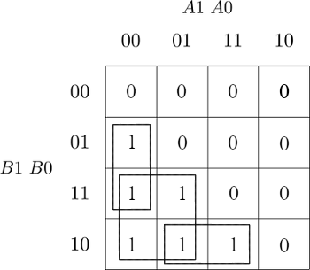

# Assignment 2
Link to this [Assignment](https://github.com/ondrasouk/Digital-electronics-1/tree/main/Labs/02-logic)  
Link to [top of repository](https://github.com/ondrasouk/Digital-electronics-1)
## Preparation
Binary comparator:
### Truth table
| **Dec. equivalent** | **B[1:0]** | **A[1:0]** | **B is greater than A** | **B equals A** | **B is less than A** |
| :-: | :-: | :-: | :-: | :-: | :-: |
| 0 | 0 0 | 0 0 | 0 | 1 | 0 |
| 1 | 0 0 | 0 1 | 0 | 0 | 1 |
| 2 | 0 0 | 1 0 | 0 | 0 | 1 |
| 3 | 0 0 | 1 1 | 0 | 0 | 1 |
| 4 | 0 1 | 0 0 | 1 | 0 | 0 |
| 5 | 0 1 | 0 1 | 0 | 1 | 0 |
| 6 | 0 1 | 1 0 | 0 | 0 | 1 |
| 7 | 0 1 | 1 1 | 0 | 0 | 1 |
| 8 | 1 0 | 0 0 | 1 | 0 | 0 |
| 9 | 1 0 | 0 1 | 1 | 0 | 0 |
| 10 | 1 0 | 1 0 | 0 | 1 | 0 |
| 11 | 1 0 | 1 1 | 0 | 0 | 1 |
| 12 | 1 1 | 0 0 | 1 | 0 | 0 |
| 13 | 1 1 | 0 1 | 1 | 0 | 0 |
| 14 | 1 1 | 1 0 | 1 | 0 | 0 |
| 15 | 1 1 | 1 1 | 0 | 1 | 0 |

equals<sub>SoP</sub> = B&#862;<sub>1</sub>B&#862;<sub>0</sub>A&#862;<sub>1</sub>A&#862;<sub>0</sub>+B&#862;<sub>1</sub>B<sub>0</sub>A&#862;<sub>1</sub>A<sub>0</sub>+B<sub>1</sub>B&#862;<sub>0</sub>A<sub>1</sub>A&#862;<sub>0</sub>+B<sub>1</sub>B<sub>0</sub>A<sub>1</sub>A<sub>0</sub>

less<sub>PoS</sub> = (B<sub>1</sub>+B<sub>0</sub>+A<sub>1</sub>+A<sub>0</sub>)&hairsp;&middot;&hairsp;(B<sub>1</sub>+B&#862;<sub>0</sub>+A<sub>1</sub>+A<sub>0</sub>)&hairsp;&middot;&hairsp;(B<sub>1</sub>+B&#862;<sub>0</sub>+A<sub>1</sub>+A&#862;<sub>0</sub>)&hairsp;&middot;&hairsp;(B&#862;<sub>1</sub>+B<sub>0</sub>+A<sub>1</sub>+A<sub>0</sub>)&hairsp;&middot;&hairsp;(B&#862;<sub>1</sub>+B<sub>0</sub>+A<sub>1</sub>+A&#862;<sub>0</sub>)&hairsp;&middot;&hairsp;(B&#862;<sub>1</sub>+B<sub>0</sub>+A&#862;<sub>1</sub>+A<sub>0</sub>)&hairsp;&middot;&hairsp;(B&#862;<sub>1</sub>+B&#862;<sub>0</sub>+A<sub>1</sub>+A<sub>0</sub>)&hairsp;&middot;&hairsp;(B&#862;<sub>1</sub>+B&#862;<sub>0</sub>+A<sub>1</sub>+A&#862;<sub>0</sub>)&hairsp;&middot;&hairsp;(B&#862;<sub>1</sub>+B&#862;<sub>0</sub>+A&#862;<sub>1</sub>+A<sub>0</sub>)&hairsp;&middot;&hairsp;(B&#862;<sub>1</sub>+B&#862;<sub>0</sub>+A&#862;<sub>1</sub>+A&#862;<sub>0</sub>)

## Logic function minimization
### function B is greater than A

### function B is equal than A

### function B is less than A

### Minimized functions

greater<sub>SoP</sub> = B<sub>1</sub>A&#862;<sub>1</sub>+B<sub>0</sub>A&#862;<sub>1</sub>A&#862;<sub>0</sub>+B<sub>1</sub>B&#862;<sub>0</sub>A<sub>0</sub>

less<sub>PoS</sub> = (A<sub>1</sub>+A<sub>0</sub>)&hairsp;&middot;&hairsp;(B&#862;<sub>1</sub>+B<sub>0</sub>)&hairsp;&middot;&hairsp;(B&#862;<sub>0</sub>+A<sub>1</sub>)&hairsp;&middot;&hairsp;(B<sub>1</sub>+A&#862;<sub>0</sub>)
## 2-bit comparator
### Architecture body of 2-bit comparator

```VHDL
architecture Behavioral of comparator_2bit is
begin
    B_greater_A_o    <= '1' when (b_i > a_i) else '0';
    B_equals_A_o     <= '1' when (b_i = a_i) else '0';
    B_less_A_o       <= '1' when (b_i < a_i) else '0';

end architecture Behavioral;
```
### Screenshot


[Playground](https://www.edaplayground.com/x/h5xe)

## 4-bit comparator
### Screenshot


[Playground](https://www.edaplayground.com/x/vVsX)

### Listing of design.vhdl
```VHDL
library ieee;
use ieee.std_logic_1164.all;

------------------------------------------------------------------------
-- Entity declaration for 2-bit binary comparator
------------------------------------------------------------------------
entity comparator_4bit is
    port(
        a_i           : in  std_logic_vector(4 - 1 downto 0);
        b_i           : in  std_logic_vector(4 - 1 downto 0);


        -- COMPLETE ENTITY DECLARATION


        B_greater_A_o    : out std_logic;       -- B is greather than A
        B_equals_A_o     : out std_logic;       -- B is equal to A
        B_less_A_o       : out std_logic        -- B is less than A
    );
end entity comparator_4bit;

------------------------------------------------------------------------
-- Architecture body for 2-bit binary comparator
------------------------------------------------------------------------
architecture Behavioral of comparator_4bit is
begin
    B_greater_A_o    <= '1' when (b_i > a_i) else '0';
    B_equals_A_o     <= '1' when (b_i = a_i) else '0';
    B_less_A_o       <= '1' when (b_i < a_i) else '0';

end architecture Behavioral;
```

### Listing of testbench.vhdl
```VHDL
library ieee;
use ieee.std_logic_1164.all;

------------------------------------------------------------------------
-- Entity declaration for testbench
------------------------------------------------------------------------
entity tb_comparator_4bit is
    -- Entity of testbench is always empty
end entity tb_comparator_4bit;

------------------------------------------------------------------------
-- Architecture body for testbench
------------------------------------------------------------------------
architecture testbench of tb_comparator_4bit is

    -- Local signals
    signal s_a       : std_logic_vector(4 - 1 downto 0);
    signal s_b       : std_logic_vector(4 - 1 downto 0);
    signal s_B_greater_A : std_logic;
    signal s_B_equals_A  : std_logic;
    signal s_B_less_A    : std_logic;

begin
    -- Connecting testbench signals with comparator_4bit entity (Unit Under Test)
    uut_comparator_4bit : entity work.comparator_4bit
        port map(
            a_i           => s_a,
            b_i           => s_b,
            B_greater_A_o => s_B_greater_A,
            B_equals_A_o  => s_B_equals_A,
            B_less_A_o    => s_B_less_A
        );

    --------------------------------------------------------------------
    -- Data generation process 0
    --------------------------------------------------------------------
    p_stimulus : process
    begin
        -- Report a note at the begining of stimulus process
        report "Stimulus process started" severity note;


        -- First test values
        s_b <= "0000"; s_a <= "0000"; wait for 100 ns;
        -- Expected output
        assert ((s_B_greater_A = '0') and (s_B_equals_A = '1') and (s_B_less_A = '0'))
        -- If false, then report an error
        report "Test failed for input combination: 0000, 0000" severity error;
        
        s_b <= "1100"; s_a <= "1010"; wait for 100 ns;
        -- Expected output
        assert ((s_B_greater_A = '1') and (s_B_equals_A = '0') and (s_B_less_A = '0'))
        -- If false, then report an error
        report "Test failed for input combination: 1100, 1010" severity error;
        
        s_b <= "0110"; s_a <= "0110"; wait for 100 ns;
        -- Expected output
        assert ((s_B_greater_A = '0') and (s_B_equals_A = '1') and (s_B_less_A = '0'))
        -- If false, then report an error
        report "Test failed for input combination: 0110, 0110" severity error;

        s_b <= "1111"; s_a <= "1111"; wait for 100 ns;
        -- Expected output
        assert ((s_B_greater_A = '0') and (s_B_equals_A = '1') and (s_B_less_A = '0'))
        -- If false, then report an error
        report "Test failed for input combination: 1111, 1111" severity error;
     
        s_b <= "1111"; s_a <= "0000"; wait for 100 ns;
        -- Expected output
        assert ((s_B_greater_A = '1') and (s_B_equals_A = '0') and (s_B_less_A = '0'))
        -- If false, then report an error
        report "Test failed for input combination: 1111, 0000" severity error;
        
        s_b <= "1000"; s_a <= "0111"; wait for 100 ns;
        -- Expected output
        assert ((s_B_greater_A = '1') and (s_B_equals_A = '0') and (s_B_less_A = '0'))
        -- If false, then report an error
        report "Test failed for input combination: 1000, 0111" severity error;
        
        s_b <= "0011"; s_a <= "0100"; wait for 100 ns;
        -- Expected output
        assert ((s_B_greater_A = '0') and (s_B_equals_A = '0') and (s_B_less_A = '1'))
        -- If false, then report an error
        report "Test failed for input combination: 0011, 0100" severity error;
        
        s_b <= "1101"; s_a <= "0100"; wait for 100 ns;
        -- Expected output
        assert ((s_B_greater_A = '1') and (s_B_equals_A = '0') and (s_B_less_A = '0'))
        -- If false, then report an error
        report "Test failed for input combination: 1101, 0100" severity error;
        
        s_b <= "0101"; s_a <= "0101"; wait for 100 ns;
        -- Expected output
        assert ((s_B_greater_A = '0') and (s_B_equals_A = '1') and (s_B_less_A = '0'))
        -- If false, then report an error
        report "Test failed for input combination: 0101, 0101" severity error;
        
        s_b <= "1010"; s_a <= "0110"; wait for 100 ns;
        -- Expected output
        assert ((s_B_greater_A = '1') and (s_B_equals_A = '0') and (s_B_less_A = '0'))
        -- If false, then report an error
        report "Test failed for input combination: 1010, 0110" severity error;
        
        s_b <= "1100"; s_a <= "1111"; wait for 100 ns;
        -- Expected output
        assert ((s_B_greater_A = '0') and (s_B_equals_A = '0') and (s_B_less_A = '1'))
        -- If false, then report an error
        report "Test failed for input combination: 1100, 1111" severity error;
        
        
        -- Report a note at the end of stimulus process
        report "Stimulus process finished" severity note;
        wait;
    end process p_stimulus;

end architecture testbench;
```
### Console output with error (edited last test)
```
[2021-02-22 18:51:14 EST] ghdl -i design.vhd testbench.vhd  && ghdl -m  tb_comparator_4bit && ghdl -r  tb_comparator_4bit   --vcd=dump.vcd && sed -i 's/^U/X/g; s/^-/X/g; s/^H/1/g; s/^L/0/g' dump.vcd 
analyze design.vhd
analyze testbench.vhd
elaborate tb_comparator_4bit
testbench.vhd:51:9:@0ms:(report note): Stimulus process started
testbench.vhd:117:9:@1100ns:(assertion error): Test failed for input combination: 1100, 1111
testbench.vhd:123:9:@1100ns:(report note): Stimulus process finished
Finding VCD file...
./dump.vcd
[2021-02-22 18:51:15 EST] Opening EPWave...
Done
```
