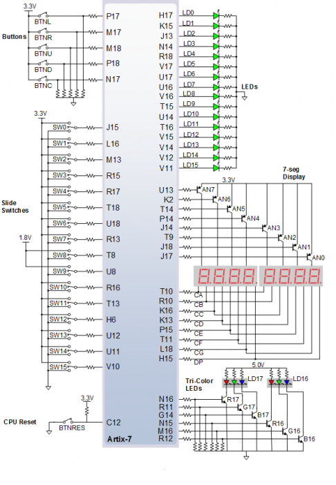
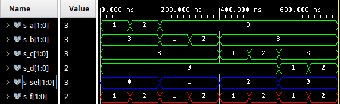

# Assignment 2
Link to this [Assignment](https://github.com/ondrasouk/Digital-electronics-1/tree/main/Labs/03-vivado)  
Link to [top of repository](https://github.com/ondrasouk/Digital-electronics-1)
## Preparation
  
[Source link](https://reference.digilentinc.com/_media/reference/programmable-logic/nexys-a7/n4r.png)  
## Multiplexer
### Listing of architecture
```VHDL
architecture Behavioral of mux_2bit_4to1 is

begin

process (a_i, b_i, c_i, d_i, sel_i)
    begin
        f_o <= a_i when (sel_i = "00") else
               b_i when (sel_i = "01") else
               c_i when (sel_i = "10") else
               d_i;
    end process;

end Behavioral;
```
### Listing of stimulus process
```VHDL
     p_stimuls : process
     begin
     report "Stimulus process started" severity note;
     --init. signal
        s_a <= "11";
        s_b <= "11";
        s_c <= "11";
        s_d <= "11";
     --1.st combination
        s_sel <= "00";
            s_a <= "01";
            wait for 100 ns;
            s_a <= "10";
            wait for 100 ns;
            s_a <= "11";
     --2.nd combination
        s_sel <= "01";
            s_b <= "01";
            wait for 100 ns;
            s_b <= "10";
            wait for 100 ns;
            s_b <= "11";
     --3.rd combination
        s_sel <= "10";
            s_c <= "01";
            wait for 100 ns;
            s_c <= "10";
            wait for 100 ns;
            s_c <= "11";
     --4.th combination
        s_sel <= "11";
            s_d <= "01";
            wait for 100 ns;
            s_d <= "10";
            wait for 100 ns;
            s_d <= "11";
        report "Stimulus process ended" severity note;
        wait;
     end process p_stimuls;
```
### Screenshot of simulation

## Tutorial
