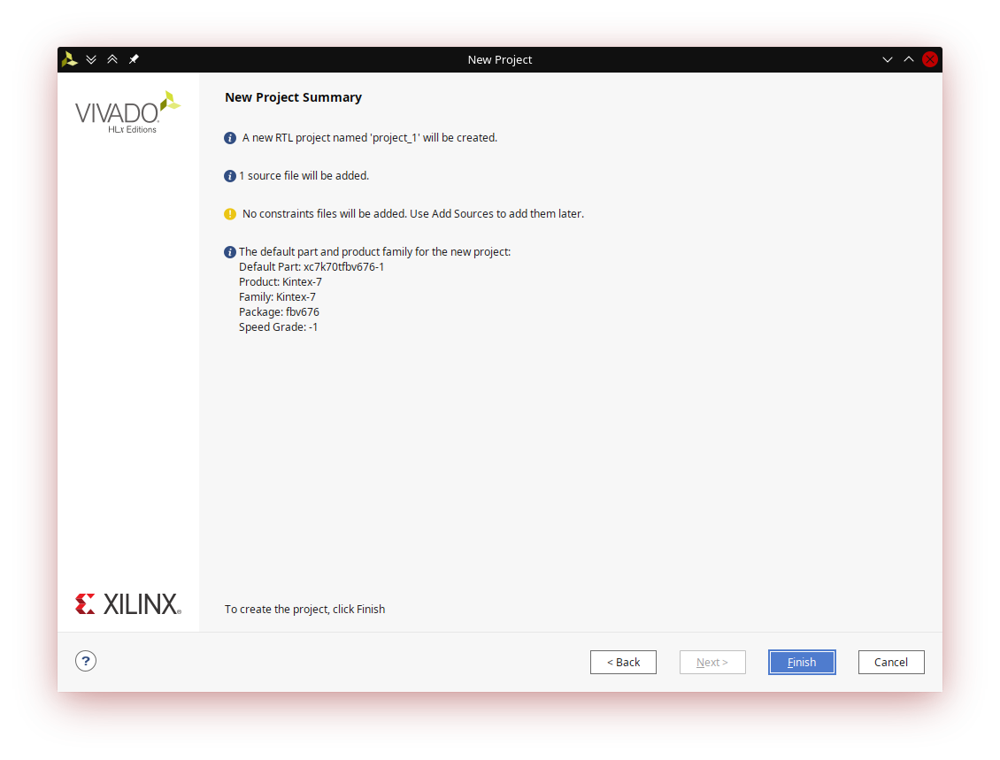
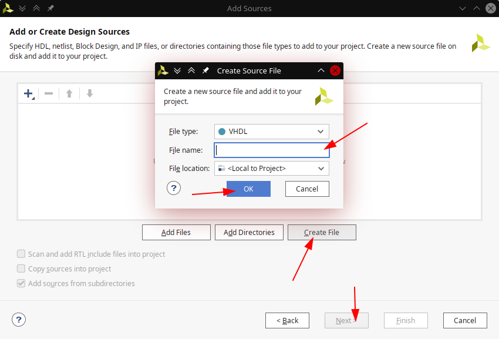

# Assignment 3
Link to this [Assignment](https://github.com/ondrasouk/Digital-electronics-1/tree/main/Labs/03-vivado)  
Link to [top of repository](https://github.com/ondrasouk/Digital-electronics-1)
## Preparation
  
[Source link](https://reference.digilentinc.com/_media/reference/programmable-logic/nexys-a7/n4r.png)  
## Multiplexer
### Listing of architecture
```VHDL
architecture Behavioral of mux_2bit_4to1 is

begin

process (a_i, b_i, c_i, d_i, sel_i)
    begin
        f_o <= a_i when (sel_i = "00") else
               b_i when (sel_i = "01") else
               c_i when (sel_i = "10") else
               d_i;
    end process;

end Behavioral;
```
### Listing of stimulus process
```VHDL
     p_stimuls : process
     begin
     report "Stimulus process started" severity note;
     --init. signal
        s_a <= "11";
        s_b <= "11";
        s_c <= "11";
        s_d <= "11";
     --1.st combination
        s_sel <= "00";
            s_a <= "01";
            wait for 100 ns;
            s_a <= "10";
            wait for 100 ns;
            s_a <= "11";
     --2.nd combination
        s_sel <= "01";
            s_b <= "01";
            wait for 100 ns;
            s_b <= "10";
            wait for 100 ns;
            s_b <= "11";
     --3.rd combination
        s_sel <= "10";
            s_c <= "01";
            wait for 100 ns;
            s_c <= "10";
            wait for 100 ns;
            s_c <= "11";
     --4.th combination
        s_sel <= "11";
            s_d <= "01";
            wait for 100 ns;
            s_d <= "10";
            wait for 100 ns;
            s_d <= "11";
        report "Stimulus process ended" severity note;
        wait;
     end process p_stimuls;
```
### Screenshot of simulation

## Tutorial
### Project creation
  
Click on File > Project > New. In opened window click on Next.
  
First specify location of new project and then project name. Click on Next.
  
Select RTL Project and click on Next.
  
Select target and simulator language as VHDL. Click on Create File and fill filename and click on OK.  
  
It will look like this.  
Next up is adding constrains files, but we will only click on Next.  
  
Next is choosing hardware and we click on Boards and then on "Nexys A7-50T" and click on Next.
  
Project summary will look like this.  
Click on Finish.  
  
There will be another dialog window with module name, enter name and click on OK.  
You have created a new project!
### Adding source file
  
Click on plus in project manager or at the toolbar > Files > Add Sources. In dialog window select design source and click on Next.
  
Click on Create File, fill filename and click on OK and Next.

Fill Entity name or add I/O ports Definitins and click on OK.
### Adding testbench file

Open dialog for adding sources and select simulation sources. Click on Next.
  
In the next window click on Create File, fill filename and click on OK and Next.
  
Fill entity name and click on OK.
### Running simulation
  
Click on toolbar in Flow > Run Simulation > Run Behavioral Simulation
  
Wait for program to complete and you will see simulation output.
