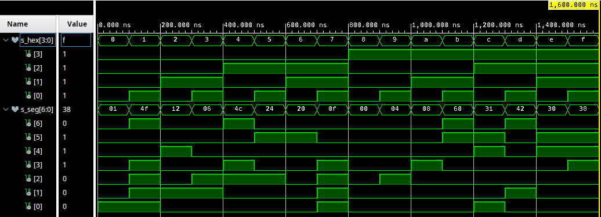
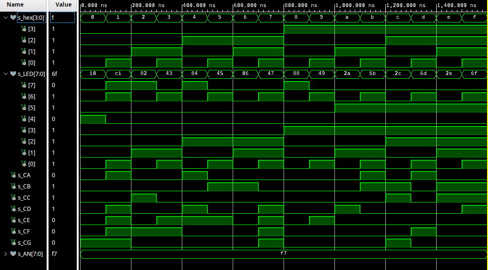

# Assignment 4
Link to this [Assignment](https://github.com/ondrasouk/Digital-electronics-1/tree/main/Labs/04-segment)  
Link to [top of repository](https://github.com/ondrasouk/Digital-electronics-1)
## 1. Preparation tasks
### 1.1 Table with connection of 7-segment displays on Nexys A7 board
  
[Source link](https://reference.digilentinc.com/_media/reference/programmable-logic/nexys-a7/n4r.png)
### 1.2 Decoder truth table for common anode 7-segment displa
| **Hex** | **Inputs** | **A** | **B** | **C** | **D** | **E** | **F** | **G** |
| :-: | :-: | :-: | :-: | :-: | :-: | :-: | :-: | :-: |
| 0 | 0000 | 0 | 0 | 0 | 0 | 0 | 0 | 1 |
| 1 | 0001 | 1 | 0 | 0 | 1 | 1 | 1 | 1 |
| 2 | 0010 | 0 | 0 | 1 | 0 | 0 | 1 | 0 |
| 3 | 0011 | 0 | 0 | 0 | 0 | 1 | 1 | 0 |
| 4 | 0100 | 1 | 0 | 0 | 1 | 1 | 0 | 0 |
| 5 | 0101 | 0 | 1 | 0 | 0 | 1 | 0 | 0 |
| 6 | 0110 | 0 | 1 | 0 | 0 | 0 | 0 | 0 |
| 7 | 0111 | 0 | 0 | 0 | 1 | 1 | 1 | 1 |
| 8 | 1000 | 0 | 0 | 0 | 0 | 0 | 0 | 0 |
| 9 | 1001 | 0 | 0 | 0 | 0 | 1 | 0 | 0 |
| A | 1010 | 0 | 0 | 0 | 1 | 0 | 0 | 0 |
| b | 1011 | 1 | 1 | 0 | 0 | 0 | 0 | 0 |
| C | 1100 | 0 | 1 | 1 | 0 | 0 | 0 | 1 |
| d | 1101 | 1 | 0 | 0 | 0 | 0 | 1 | 0 |
| E | 1110 | 0 | 1 | 1 | 0 | 0 | 0 | 0 |
| F | 1111 | 0 | 1 | 1 | 1 | 0 | 0 | 0 |
## 2. Seven-segment display decoder
### 2.1 Listing of VHDL architecture
```VHDL
architecture Behavioral of hex_7seg is

begin
    --------------------------------------------------------------------
    -- p_7seg_decoder:
    -- A combinational process for 7-segment display decoder. 
    -- Any time "hex_i" is changed, the process is "executed".
    -- Output pin seg_o(6) corresponds to segment A, seg_o(5) to B, etc.
    --------------------------------------------------------------------
    p_7seg_decoder : process(hex_i)begin
        case hex_i is
            when "0000" =>              -- 0
                seg_o <= "0000001";
            when "0001" =>              -- 1
                seg_o <= "1001111";
            when "0010" =>              -- 2
                seg_o <= "0010010";
            when "0011" =>              -- 3
                seg_o <= "0000110";
            when "0100" =>              -- 4
                seg_o <= "1001100";
            when "0101" =>              -- 5
                seg_o <= "0100100";
            when "0110" =>              -- 6
                seg_o <= "0100000";
            when "0111" =>              -- 7
                seg_o <= "0001111";
            when "1000" =>              -- 8
                seg_o <= "0000000";
            when "1001" =>              -- 9
                seg_o <= "0000100";
            when "1010" =>              -- A
                seg_o <= "0001000";
            when "1011" =>              -- B
                seg_o <= "1100000";
            when "1100" =>              -- C   
                seg_o <= "0110001";
            when "1101" =>              -- D
                seg_o <= "1000010";
            when "1110" =>              -- E
                seg_o <= "0110000";
            when "1111" =>              -- F
                seg_o <= "0111000";
            when others =>              -- undefined
                seg_o <= "0000000";
        end case;
    end process p_7seg_decoder;

end Behavioral;
```
### 2.2 Listing of VHDL stimulus process
```VHDL
tb_stimuls: process begin
    report "Stimulus process started" severity note;
    s_hex <= "0000";    -- 0
    wait for 100 ns;
    s_hex <= "0001";    -- 1
    wait for 100 ns;
    s_hex <= "0010";    -- 2
    wait for 100 ns;
    s_hex <= "0011";    -- 3
    wait for 100 ns;
    s_hex <= "0100";    -- 4
    wait for 100 ns;
    s_hex <= "0101";    -- 5
    wait for 100 ns;
    s_hex <= "0110";    -- 6
    wait for 100 ns;
    s_hex <= "0111";    -- 7
    wait for 100 ns;
    s_hex <= "1000";    -- 8
    wait for 100 ns;
    s_hex <= "1001";    -- 9
    wait for 100 ns;
    s_hex <= "1010";    -- A
    wait for 100 ns;
    s_hex <= "1011";    -- B
    wait for 100 ns;
    s_hex <= "1100";    -- C
    wait for 100 ns;
    s_hex <= "1101";    -- D
    wait for 100 ns ;
    s_hex <= "1110";    -- E
    wait for 100 ns ;
    s_hex <= "1111";    -- F
    wait for 100 ns ;
    report "Stimulus process ended" severity note;
    wait;
end process tb_stimuls;
```
### 2.3 Screenshot with simulated time waveforms

### 2.4 Listing of VHDL code from source file top.vhd with 7-segment module instantiation
```VHDL
entity top is
    Port ( SW : in STD_LOGIC_VECTOR (3 downto 0);
           CA : out STD_LOGIC;
           CB : out STD_LOGIC;
           CC : out STD_LOGIC;
           CD : out STD_LOGIC;
           CE : out STD_LOGIC;
           CF : out STD_LOGIC;
           CG : out STD_LOGIC;
           AN : out STD_LOGIC_VECTOR (7 downto 0);
           LED : out STD_LOGIC_VECTOR (7 downto 0));
end top;

------------------------------------------------------------------------
-- Architecture body for top level
------------------------------------------------------------------------
architecture Behavioral of top is
begin

    --------------------------------------------------------------------
    -- Instance (copy) of hex_7seg entity
    hex2seg : entity work.hex_7seg
        port map(
            hex_i    => SW,
            seg_o(6) => CA,
            seg_o(5) => CB,
            seg_o(4) => CC,            
            seg_o(3) => CD,
            seg_o(2) => CE,
            seg_o(1) => CF,
            seg_o(0) => CG
        );

    -- Connect one common anode to 3.3V
    AN <= b"1111_0111";

    -- Display input value on LEDs
    LED(3 downto 0) <= SW;


    -- LED(7:4) indicators
    -- Turn LED(4) on if input value is equal to 0, ie "0000"
    LED(4) <= '1' when (SW = "0000") else '0';
    
    -- Turn LED(5) on if input value is greater than "1001", ie 9
    LED(5) <= '1' when (SW >"1001") else '0';
    
    -- Turn LED(6) on if input value is odd, ie 1, 3, 5, ...
    LED(6) <= SW(0);
    
    -- Turn LED(7) on if input value is a power of two, ie 1, 2, 4, or 8
    LED(7) <= '1' when SW = "0001" else
              '1' when SW = "0010" else
              '1' when SW = "0100" else
              '1' when SW = "1000" else
              '0';

end architecture Behavioral;
```
## 3. LED(7:4) indicators
### 3.1 Truth table and listing of VHDL code for LEDs(7:4)
| **Hex** | **Inputs** | **LED4** | **LED5** | **LED6** | **LED7** |
| :-: | :-: | :-: | :-: | :-: | :-: |
| 0 | 0000 | 1 | 0 | 0 | 0 |
| 1 | 0001 | 0 | 0 | 1 | 1 |
| 2 | 0010 | 0 | 0 | 0 | 1 |
| 3 | 0011 | 0 | 0 | 1 | 0 |
| 4 | 0100 | 0 | 0 | 0 | 1 |
| 5 | 0101 | 0 | 0 | 1 | 0 |
| 6 | 0110 | 0 | 0 | 0 | 0 |
| 7 | 0111 | 0 | 0 | 1 | 0 |
| 8 | 1000 | 0 | 0 | 0 | 1 |
| 9 | 1001 | 0 | 0 | 1 | 0 |
| A | 1010 | 0 | 1 | 0 | 0 |
| b | 1011 | 0 | 1 | 1 | 0 |
| C | 1100 | 0 | 1 | 0 | 0 |
| d | 1101 | 0 | 1 | 1 | 0 |
| E | 1110 | 0 | 1 | 0 | 0 |
| F | 1111 | 0 | 1 | 1 | 0 |


```VHDL
    -- Display input value on LEDs
    LED(3 downto 0) <= SW;

    -- LED(7:4) indicators
    -- Turn LED(4) on if input value is equal to 0, ie "0000"
    LED(4) <= '1' when (SW = "0000") else '0';
    
    -- Turn LED(5) on if input value is greater than "1001", ie 9
    LED(5) <= '1' when (SW >"1001") else '0';
    
    -- Turn LED(6) on if input value is odd, ie 1, 3, 5, ...
    LED(6) <= SW(0);
    
    -- Turn LED(7) on if input value is a power of two, ie 1, 2, 4, or 8
    LED(7) <= '1' when SW = "0001" else
              '1' when SW = "0010" else
              '1' when SW = "0100" else
              '1' when SW = "1000" else
              '0';
```
### 3.2 Screenshot with simulated time waveforms

