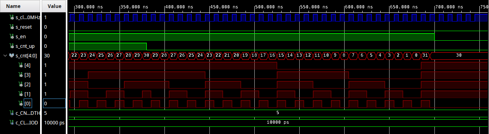

# Assignment 5
Link to this [Assignment](https://github.com/ondrasouk/Digital-electronics-1/tree/main/Labs/05-counter)  
Link to [top of repository](https://github.com/ondrasouk/Digital-electronics-1)
## 1. Preparation tasks
### 1.1 Figure with connection of push buttons on Nexys A7 board
  
[Source link](https://reference.digilentinc.com/_media/reference/programmable-logic/nexys-a7/n4r.png)
### 1.2 Timing table
| **Time interval** | **Number of clk periods** | **Number of clk periods in hex** | **Number of clk periods in binary** |
   | :-: | :-: | :-: | :-: |
   | 2&nbsp;ms | 200 000 | `x"3_0D40"` | `b"0011_0000_1101_0100_0000"` |
   | 4&nbsp;ms | 400 000 |`x"6_1A80"` | `b"0110_001_1010_1000_0000"` |
   | 10&nbsp;ms | 1 000 000 |`x"F_4240"`| `b"1111_0100_0010_0100_0000"` |
   | 250&nbsp;ms | 25 000 000 | `x"17D_7840"` | `b"0001_0111_1101_0111_1000_0100_0000"` |
   | 500&nbsp;ms | 50 000 000 | `x"2FA_F080"` | `b"0010_1111_1010_1111_0000_1000_0000"` |
   | 1&nbsp;sec | 100 000 000 | `x"5F5_E100"` | `b"0101_1111_0101_1110_0001_0000_0000"` |
## 2. Bidirectional counter
### 2.1 Listing of VHDL process 'p_cnt_up_down'
```VHDL

```
### 2.2 Listing of VHDL reset and stimulus processes from testbench file tb_cnt_up_down.vhd
```VHDL

```
### 2.3 Screenshot with simulated time waveforms


## 3. Top level
### 3.1 Listing of VHDL code from source file top.vhd

### 3.2 Image of the top layer
