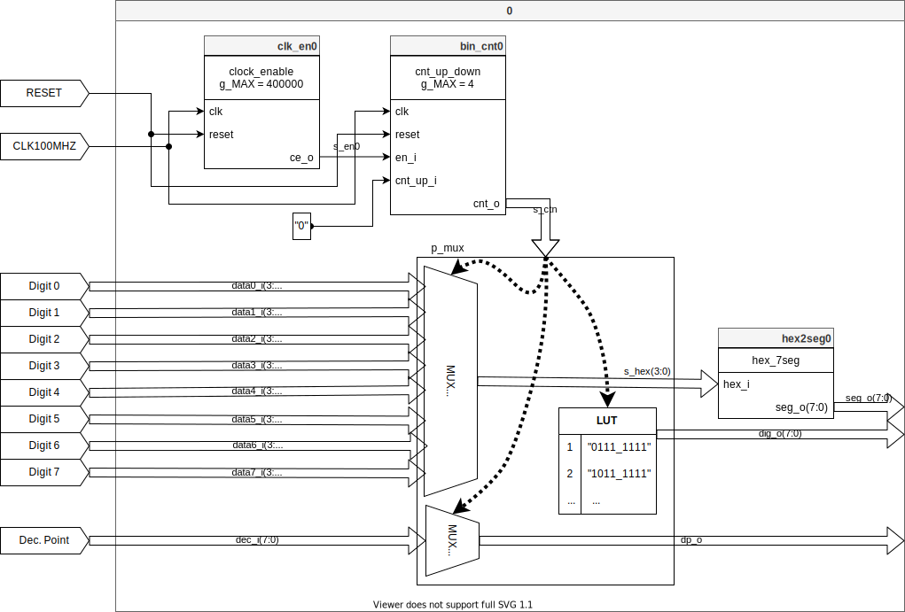

# Assignment 6
Link to this [Assignment](https://github.com/ondrasouk/Digital-electronics-1/tree/main/Labs/06-display_driver)  
Link to [top of repository](https://github.com/ondrasouk/Digital-electronics-1)
## 1. Preparation tasks

## 2. Display driver
### 2.1 Listing of VHDL code of the process `p_mux`
```VHDL
    p_mux : process(s_cnt, data0_i, data1_i, data2_i, data3_i, dp_i)
    begin
        case s_cnt is
            when "11" =>
                s_hex <= data3_i;
                dp_o  <= dp_i(3);
                dig_o <= "0111";

            when "10" =>
                s_hex <= data2_i;
                dp_o  <= dp_i(2);
                dig_o <= "1011";

            when "01" =>
                s_hex <= data1_i;
                dp_o  <= dp_i(1);
                dig_o <= "1101";

            when others =>
                s_hex <= data0_i;
                dp_o  <= dp_i(0);
                dig_o <= "1110";
        end case;
    end process p_mux;
```
### 2.2 Listing of VHDL testbench file `tb_driver_7seg_4digits`
```VHDL
library ieee;
use ieee.std_logic_1164.all;

------------------------------------------------------------------------
-- Entity declaration for testbench
------------------------------------------------------------------------
entity tb_driver_7seg_4digits is
    -- Entity of testbench is always empty
end entity tb_driver_7seg_4digits;

------------------------------------------------------------------------
-- Architecture body for testbench
------------------------------------------------------------------------
architecture testbench of tb_driver_7seg_4digits is

    -- Local constants
    constant c_CLK_100MHZ_PERIOD : time    := 10 ns;
    --change g_MAX in driver_7seg_4digits.vhd to 4 from 400000 to have smaller simulation time

    --Local signals
    signal s_clk_100MHz : std_logic;
    signal s_reset      : std_logic;
    signal s_data0      : std_logic_vector(3 downto 0);
    signal s_data1      : std_logic_vector(3 downto 0);
    signal s_data2      : std_logic_vector(3 downto 0);
    signal s_data3      : std_logic_vector(3 downto 0);
    signal s_dpi        : std_logic_vector(3 downto 0);
    signal s_dpo        : std_logic;
    signal s_seg        : std_logic_vector(6 downto 0);
    signal s_dig        : std_logic_vector(3 downto 0);
begin
    -- Connecting testbench signals with driver_7seg_4digits entity
    -- (Unit Under Test)
    uut_driver_7seg_4digits: entity work.driver_7seg_4digits
        port map(
            clk     => s_clk_100MHz,
            reset   => s_reset,
            -- 4-bit input values for individual digits
            data0_i => s_data0,
            data1_i => s_data1,
            data2_i => s_data2,
            data3_i => s_data3,
            -- 4-bit input value for decimal points
            dp_i    => s_dpi,
            -- Decimal point for specific digit
            dp_o    => s_dpo,
            -- Cathode values for individual segments
            seg_o   => s_seg,
            -- Common anode signals to individual displays
            dig_o   => s_dig
        );
    --------------------------------------------------------------------
    -- Clock generation process
    --------------------------------------------------------------------
    p_clk_gen : process
    begin
        while now < 750 ns loop         -- 75 periods of 100MHz clock
            s_clk_100MHz <= '0';
            wait for c_CLK_100MHZ_PERIOD / 2;
            s_clk_100MHz <= '1';
            wait for c_CLK_100MHZ_PERIOD / 2;
        end loop;
        wait;
    end process p_clk_gen;

    --------------------------------------------------------------------
    -- Reset generation process
    --------------------------------------------------------------------
    p_reset : process
    begin
        s_reset <= '1';
        wait for 10 ns;
        s_reset <= '0';
        wait;
    end process p_reset;

    --------------------------------------------------------------------
    -- Data generation process
    --------------------------------------------------------------------
    p_stimulus : process
    begin
        s_data3 <= "0011";
        s_data2 <= "0001";
        s_data1 <= "0100";
        s_data0 <= "0010";
        s_dpi   <= "0111";
        
        wait for 1 ns; -- wait some time for s_reset to turn to 1
        if (s_reset = '1') then
            wait until falling_edge(s_reset);
            wait until rising_edge(s_clk_100MHz);-- wait for one aditional clock for counter to start counting
            wait for 11 ns;                      -- wait for 10ns + 1ns to delay the test
        end if;
        
        wait for 39 ns; -- wait for 40ns - 1ns
        assert (s_seg = "0000110") and (s_dig = "0111") and (s_dpo = '0')
        -- test 1.st digit for number 3 and dec. point
        report "1.st digit displayed incorrectly" severity error;
        
        wait for 40 ns; -- wait for next digit
        assert (s_seg = "1001111") and (s_dig = "1011") and (s_dpo = '1')
        -- test 2.nd digit for number 1 and no dec. point
        report "2.nd digit displayed incorrectly" severity error;
        
        wait for 40 ns; -- wait for next digit
        assert (s_seg = "1001100") and (s_dig = "1101") and (s_dpo = '1')
        -- test 3.rd digit for number 4 and no dec. point
        report "3.rd digit displayed incorrectly" severity error;
        
        wait for 40 ns; -- wait for next digit
        assert (s_seg = "0010010") and (s_dig = "1110") and (s_dpo = '1')
        -- test 4.th digit for number 2 and no dec. point
        report "4.th digit displayed incorrectly" severity error;
        
    end process p_stimulus;

end architecture testbench;

```
### 2.3 Screenshot with simulated time waveforms

### 2.4 Listing of VHDL architecture of the top layer
```VHDL
architecture Behavioral of top is
    -- No internal signals
begin

    --------------------------------------------------------------------
    -- Instance (copy) of driver_7seg_4digits entity
    driver_seg_4 : entity work.driver_7seg_4digits
        port map(
            clk        => CLK100MHZ,
            reset      => BTNC,
            data0_i(3) => SW(3),
            data0_i(2) => SW(2),
            data0_i(1) => SW(1),
            data0_i(0) => SW(0),
            data1_i(3) => SW(7),
            data1_i(2) => SW(6),
            data1_i(1) => SW(5),
            data1_i(0) => SW(4),
            data2_i(3) => SW(11),
            data2_i(2) => SW(10),
            data2_i(1) => SW(9),
            data2_i(0) => SW(8),
            data3_i(3) => SW(15),
            data3_i(2) => SW(14),
            data3_i(1) => SW(13),
            data3_i(0) => SW(12),
            dp_i => "0111",
            seg_o(6)   => CA,
            seg_o(5)   => CB,
            seg_o(4)   => CC,
            seg_o(3)   => CD,
            seg_o(2)   => CE,
            seg_o(1)   => CF,
            seg_o(0)   => CG,
            dp_o       => DP,
            dig_o      => AN(3 downto 0)
        );

    -- Disconnect the top four digits of the 7-segment display
    AN(7 downto 4) <= b"1111";

end architecture Behavioral;
```
## 3. Eight-digit driver



