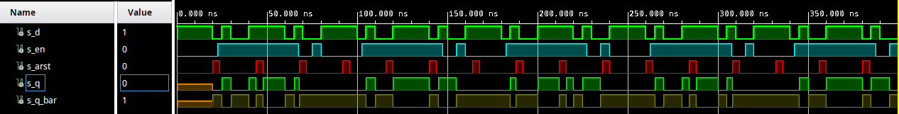
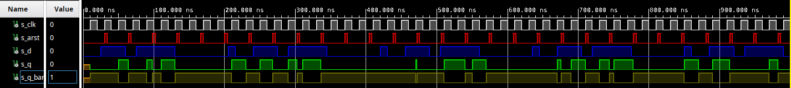
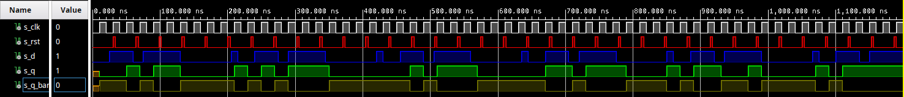
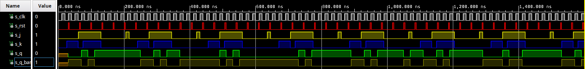
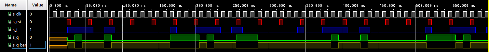

# Assignment 7
Link to this [Assignment](https://github.com/ondrasouk/Digital-electronics-1/tree/main/Labs/07-ffs)  
Link to [top of repository](https://github.com/ondrasouk/Digital-electronics-1)
## 1. Preparation tasks
### 1.1 D-type flip-flop

### 1.2 JK-type flip-flop

### 1.3 T-type flip-flop

## 2. D latch
### 2.1 Listing of VHDL code of the process `p_d_latch`
```VHDL

```
### 2.2 Listing of VHDL reset and stimulus processes from the testbench `tb_d_latch.vhd`
```VHDL

```
### 2.3 Screenshot with simulated time waveforms

## 3. Flip-flops
### 3.1 Listing of VHDL code of the processes
#### 3.1.1 Listing of VHDL code of the process `p_d_ff_arst`
```VHDL

```
#### 3.1.2 Listing of VHDL code of the process `p_d_ff_rst`
```VHDL

```
#### 3.1.3 Listing of VHDL code of the process `p_jk_ff_rst`
```VHDL

```
#### 3.1.4 Listing of VHDL code of the process `p_t_ff_rst`
```VHDL

```
### 3.2 Listing of Testbench processes `clock`, `reset`, `stimulus`
#### 3.2.1 Listing of testbench for `p_d_ff_arst`
```VHDL

```
#### 3.2.2 Listing of testbench for `p_d_ff_rst`
```VHDL

```
#### 3.2.3 Listing of testbench for `p_jk_ff_rst`
```VHDL

```
#### 3.2.4 Listing of testbench for `p_t_ff_rst`
```VHDL

```
### 3.3 Screenshots with simulated time waveforms
#### 3.3.1 `p_d_ff_arst`

#### 3.3.2 `p_d_ff_arst`

#### 3.3.3 `p_d_ff_arst`

#### 3.3.4 `p_d_ff_arst`

## 4. Shift register scheme
