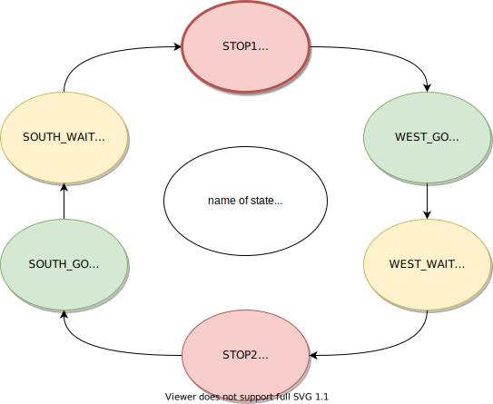

# Assignment 8
Link to this [Assignment](https://github.com/ondrasouk/Digital-electronics-1/tree/main/Labs/08-traffic_lights)  
Link to [top of repository](https://github.com/ondrasouk/Digital-electronics-1)
## 1. Preparation tasks
### 1.1 State table
| **Input P** | `0` | `0` | `1` | `1` | `0` | `1` | `0` | `1` | `1` | `1` | `1` | `0` | `0` | `1` | `1` | `1` |
| :-- | :-: | :-: | :-: | :-: | :-: | :-: | :-: | :-: | :-: | :-: | :-: | :-: | :-: | :-: | :-: | :-: |
| **Clock** |  |  |  |  |  |  |  |  |  |  |  |  |  |  |  |  |
| **State** | A | A | B | C | C | D | A | B | C | D | B | B | B | C | D | B |
| **Output R** | `0` | `0` | `0` | `0` | `0` | `1` | `0` | `0` | `0` | `1` | `0` | `0` | `0` | `0` | `1` | `0` |

### 1.2 Connection of RGB LEDs on Nexys A7
  
| **RGB LED** | **Artix-7 pin names** | **Red** | **Yellow** | **Green** |
| :-: | :-: | :-: | :-: | :-: |
| LD16 | N15, M16, R12 | `1,0,0` | `1,1,0` | `0,1,0` |
| LD17 | N16, R11, G14 | `1,0,0` | `1,1,0` | `0,1,0` |

## 2. Traffic light controller
### 2.1 State diagram

### 2.2 Listing of VHDL code of sequential process `p_traffic_fsm`
```VHDL
    --------------------------------------------------------------------
    -- p_traffic_fsm:
    -- The sequential process with synchronous reset and clock_enable 
    -- entirely controls the s_state signal by CASE statement.
    --------------------------------------------------------------------
    p_traffic_fsm : process(clk)
    begin
        if rising_edge(clk) then
            if (reset = '1') then       -- Synchronous reset
                s_state <= STOP1 ;      -- Set initial state
                s_cnt   <= c_ZERO;      -- Clear all bits

            elsif (s_en = '1') then
                -- Every 250 ms, CASE checks the value of the s_state 
                -- variable and changes to the next state according 
                -- to the delay value.
                case s_state is

                    -- If the current state is STOP1, then wait 1 sec
                    -- and move to the next GO_WAIT state.
                    when STOP1 =>
                        -- Count up to c_DELAY_1SEC
                        if (s_cnt < c_DELAY_1SEC) then
                            s_cnt <= s_cnt + 1;
                        else
                            -- Move to the next state
                            s_state <= WEST_GO;
                            -- Reset local counter value
                            s_cnt   <= c_ZERO;
                        end if;

                    when WEST_GO =>
                        if (s_cnt < c_DELAY_4SEC) then
                            s_cnt <= s_cnt + 1;
                        else
                            s_state <= WEST_WAIT;
                            s_cnt <= c_ZERO;
                        end if; 
                        
                    when WEST_WAIT =>
                        if (s_cnt < c_DELAY_2SEC) then
                            s_cnt <= s_cnt + 1;
                        else
                            s_state <= STOP2;
                            s_cnt <= c_ZERO;
                        end if; 
                        
                    when STOP2 =>
                        if (s_cnt < c_DELAY_1SEC) then
                            s_cnt <= s_cnt + 1;
                        else
                            s_state <= SOUTH_GO;
                            s_cnt <= c_ZERO;
                        end if; 
                        
                    when SOUTH_GO =>
                        if (s_cnt < c_DELAY_4SEC) then
                            s_cnt <= s_cnt + 1;
                        else
                            s_state <= SOUTH_WAIT;
                            s_cnt <= c_ZERO;
                        end if;
                        
                    when SOUTH_WAIT =>
                        if (s_cnt < c_DELAY_2SEC) then
                            s_cnt <= s_cnt + 1;
                        else
                            s_state <= STOP1;
                            s_cnt <= c_ZERO;
                        end if; 
                    when others =>
                        s_state <= STOP1;

                end case;
            end if; -- Synchronous reset
        end if; -- Rising edge
    end process p_traffic_fsm;
```
### 2.3 Listing of VHDL code of combinatorial process `p_output_fsm`
```VHDL
    --------------------------------------------------------------------
    -- p_output_fsm:
    -- The combinatorial process is sensitive to state changes, and sets
    -- the output signals accordingly. This is an example of a Moore 
    -- state machine because the output is set based on the active state.
    --------------------------------------------------------------------
    p_output_fsm : process(s_state)
    begin
        case s_state is
            when STOP1 =>
                south_o <= c_RED;
                west_o  <= c_RED;
            when WEST_GO =>
                south_o <= c_RED;
                west_o  <= c_GREEN;
            when WEST_WAIT =>
                south_o <= c_RED;
                west_o  <= c_YELLOW;
            when STOP2 =>
                south_o <= c_RED;
                west_o  <= c_RED;
            when SOUTH_GO =>
                south_o <= c_GREEN;
                west_o  <= c_RED;
            when SOUTH_WAIT =>
                south_o <= c_YELLOW;
                west_o  <= c_RED;
            when others =>
                south_o <= c_RED;
                west_o  <= c_RED;
        end case;
    end process p_output_fsm;
```
### 2.4 Screenshot of simulation

## 3. Smart controller
### 3.1 State table
| **Actual State** | **Output west** | **Output south** | **No cars** | **Cars on west** | **Cars on south** | **Booth direction** |
| :-: | :-: | :-: | :-: | :-: | :-: | :-: |
| STOP1 | `RED` | `RED` | WEST_GO | WEST_GO | WEST_GO | WEST_GO |
| WEST_GO | `GREEN` | `RED` | WEST_GO | WEST_GO |  WEST_WAIT | WEST_WAIT |
| WEST_WAIT | `YELLOW` | `RED` | STOP2 | STOP2 | STOP2 | STOP2 |
| STOP2 | `RED` | `RED` | SOUTH_GO | SOUTH_GO | SOUTH_GO | SOUTH_GO |
| SOUTH_GO | `RED` | `GREEN` | SOUTH_GO | SOUTH_WAIT | SOUTH_GO | SOUTH_WAIT |
| SOUTH_WAIT| `RED` | `YELLOW` | STOP1 | STOP1 | STOP1 | STOP1 |
### 3.2 State diagram

### 3.3 Listing of VHDL code of sequential process p_smart_traffic_fsm
```VHDL
    p_smart_traffic_fsm : process(clk)
    begin
        if rising_edge(clk) then
            if (reset = '1') then       -- Synchronous reset
                s_state <= STOP1 ;      -- Set initial state
                s_cnt   <= c_ZERO;      -- Clear all bits

            elsif (s_en = '1') then
                -- Every 250 ms, CASE checks the value of the s_state 
                -- variable and changes to the next state according 
                -- to the delay value.
                case s_state is

                    -- If the current state is STOP1, then wait 1 sec
                    -- and move to the next GO_WAIT state.
                    when STOP1 =>
                        -- Count up to c_DELAY_1SEC
                        if (s_cnt < c_DELAY_1SEC) then
                            s_cnt <= s_cnt + 1;
                        else
                            -- Move to the next state
                            s_state <= WEST_GO;
                            -- Reset local counter value
                            s_cnt   <= c_ZERO;
                        end if;

                    when WEST_GO =>
                        if (s_cnt > c_DELAY_4SEC) and (south_sense_i = '1') then
                            s_state <= WEST_WAIT;
                            s_cnt <= c_ZERO;
                        elsif (s_cnt > c_DELAY_4SEC) then
                            s_cnt <= c_DELAY_4SEC + 1;
                        else
                            s_cnt <= s_cnt + 1;
                        end if; 
                        
                    when WEST_WAIT =>
                        if (s_cnt < c_DELAY_2SEC) then
                            s_cnt <= s_cnt + 1;
                        else
                            s_state <= STOP2;
                            s_cnt <= c_ZERO;
                        end if; 
                        
                    when STOP2 =>
                        if (s_cnt < c_DELAY_1SEC) then
                            s_cnt <= s_cnt + 1;
                        else
                            s_state <= SOUTH_GO;
                            s_cnt <= c_ZERO;
                        end if; 
                        
                    when SOUTH_GO =>
                        if (s_cnt > c_DELAY_4SEC) and (west_sense_i = '1') then
                            s_state <= SOUTH_WAIT;
                            s_cnt <= c_ZERO;
                        elsif (s_cnt > c_DELAY_4SEC) then
                            s_cnt <= c_DELAY_4SEC + 1;
                        else
                            s_cnt <= s_cnt + 1;
                        end if;
                        
                    when SOUTH_WAIT =>
                        if (s_cnt < c_DELAY_2SEC) then
                            s_cnt <= s_cnt + 1;
                        else
                            s_state <= STOP1;
                            s_cnt <= c_ZERO;
                        end if; 
                    when others =>
                        s_state <= STOP1;

                end case;
            end if; -- Synchronous reset
        end if; -- Rising edge
    end process p_smart_traffic_fsm;
```
